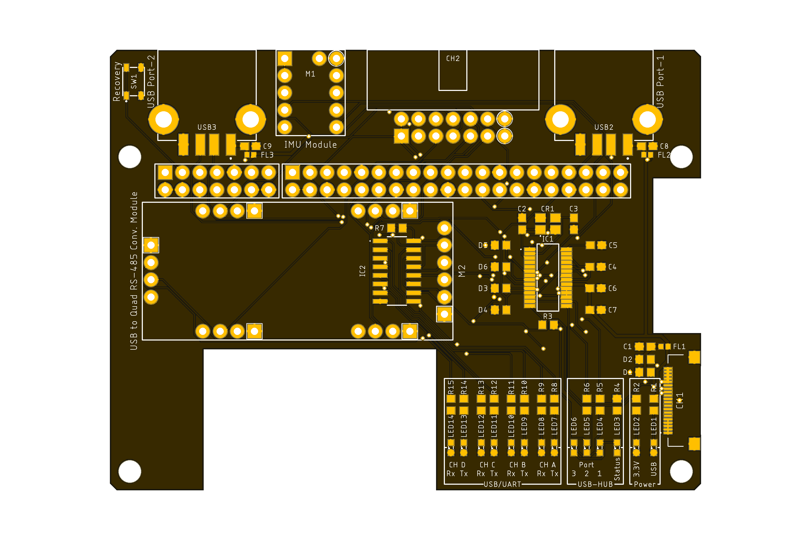
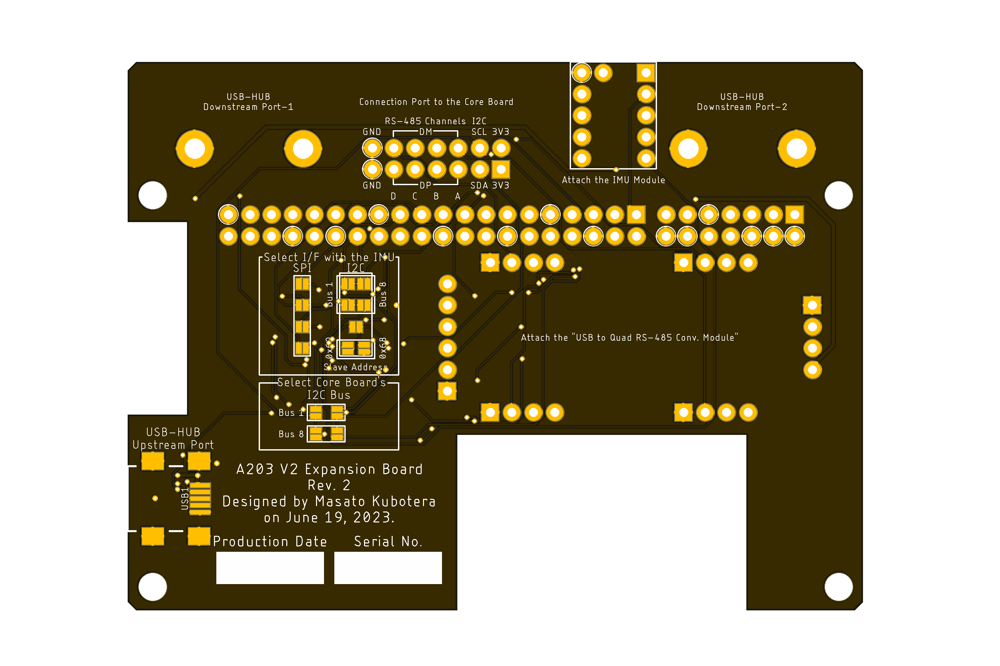

<html lang="en">

<head>
    <meta charset="uft-8">
    <meta name="author" content="Masato Kubotera">
    <meta name="description" content="">
</head>

<body>
    
<strong>This product is currently under development!</strong>

    <h1>A203 V2 Expansion Board</h1>
        

            This product is a board that expands the functions of the A203 (Version 2) carrier board manufactured by Seeed Stuido, developed for the SUSTAINA-OPTM. Several modules developed for SUSTAINA-OPTM can be attached/connected to this board and used by connecting to the Multifunctional Port and USB Port on the carrier board. In addition, the USB 2.0 High Speed(480MHz) 3-Port Hub is installed for further expandability.
        

    <h2>Features Rev. 1</h2>
        

            <table>
                <tr>
                    <th>Top Surface of PCB</th>
                    <th>Bottom Surface of PCB</th>
                    <th>Assembled Electronic Components</th>
                </tr>
                <tr>
                    <td></td>
                    <td></td>
                    <td></td>
                </tr>
            </table>
        

    <h3>PCB</h3>
        

            <ul>
                <li>81.20mm x 46.40mm PCB layout</li>
                The shape of the connector does not interfere with the connectors on the A203 V2.
                <li>Two types of USB-HUB Upstream Ports</li>
                    <ul>
                        <li>0.5mm pitch 20P ZIF Connector</li>
                        Compliant with W11: 20PIN(USB 3.0 ZIF) on the A203 V2.
                        <li>USB Mini-B Connector (Optional)</li>
                    </ul>
                <li>2 x USB 2.0 Type-A USB-HUB Downstream Ports</li>
                <li>1 x <a href="https://github.com/SUSTAINA-OP/ICM-42688-P-Module">SUSTAINA-OP/ICM-42688-P-Module</a> Attachment Port</li>
                The I/F with A203V2 can be selected from the following using the shortlands on the product.
                <ul>
                    <li>SPI </li>
                    <li>I2C: Selectable slave address 0x68/0x69</li>
                </ul>
                <li>1 x <a href="https://github.com/SUSTAINA-OP/USB-to-Quad-RS-485-Conv-Module">SUSTAINA-OP/USB-to-Quad-RS-485-Conv-Module</a> Attachment Port</li>
                <li>14 x LED Indicators</li>
                <li>
                    1 x Port for Connection to <a href="https://github.com/SUSTAINA-OP/SUSTAINA-Core-Board">SUSTAINA-OP/SUSTAINA-Core-Board</a>
                    <ul>
                        <li>2 x 7 Pin Flat Cable Connector (MIL Standard Connector)
                            <ul>
                                <li><strong>2 x 3V3</strong>: 3.3 V Power Supply</li>
                                <li><strong>SCL</strong>: I2C Serial Clock</li>
                                <li><strong>SDA</strong>: I2C Serial Data</li>
                                <li><strong>A-DP</strong>: RS-485 Data Signal Plus of CH-A</li>
                                <li><strong>A-DM</strong>: RS-485 Data Signal Minus of CH-A</li>
                                <li><strong>B-DP</strong>: RS-485 Data Signal Plus of CH-B</li>
                                <li><strong>B-DM</strong>: RS-485 Data Signal Minus of CH-B</li>
                                <li><strong>C-DP</strong>: RS-485 Data Signal Plus of CH-C</li>
                                <li><strong>C-DM</strong>: RS-485 Data Signal Minus of CH-C</li>
                                <li><strong>D-DP</strong>: RS-485 Data Signal Plus of CH-D</li>
                                <li><strong>D-DM</strong>: RS-485 Data Signal Minus of CH-D</li>
                                <li><strong>2 x GND</strong>: Common Ground</li>
                            </ul>
                        </li>
                    </ul>
                </li>
            </ul>
        

    <h2>Development Environments</h2>
    

        This product is designed with the following software.
            <ul>
                <li><a href="https://www.autodesk.com/products/eagle/overview">Autodesk Eagle 9.6.2</a></li>
            </ul>
    

    <h2>Repository Contents</h2>
        

            <dl>
                <dt><a href="/images">\images</a></dt>
                <dd>PCB preview images and capture of design screen</dd>
                <dt><a href="/libraries">\libraries</a></dt>
                <dd>Libraries used in Autodesk Eagle design</dd>
                <dt><a href="/pcb_order">\pcb_order</a> </dt>
                <dd>Gerber data and documentation for ordering PCB</dd>
                <dt><a href="/schematic.pdf">schematic.pdf</a></dt>
                <dd>Circuit diagram of this product</dd>
                <dt>*.brd</dt>
                <dd>Board wiring design file by Autodesk Eagle</dd>
                <dt>*.sch</dt>
                <dd>Circuit diagram design file by Autodesk Eagle</dd>
                <dt><a href="/.gitignore">.gitignore</a></dt>
                <dd>A file that tells Git not to track a particular file</dd>            <dt><a href="/LICENSE">LICENSE</a></dt>
                <dd>License to use this product</dd>
            </dl>
        

    <h2>Documentation</h2>
        

            The following documents are available for this product.
            <ul>
                <li><a href="/pcb_order/README.md">\pcb_order\README.md</a>: Information for ordering the PCB or PCBA</li>
            </ul>
        

    <h2>References</h2>
        

        

    <h2>Contact</h2>
        

            If you have any questions, please contact the designer of this product, Masato Kubodera, by <a href="mailto:masato.kubotera@sustaina-op.com">e-mail</a>. 
            E-mail: <a href="mailto:masato.kubotera@sustaina-op.com">masato.kubotera@sustaina-op.com</a>
        

    <h2>License Information</h2>
        

            This product is open source. Please review the <a href="/LICENSE">LICENSE</a> for license information. 
             
            This product by Masato Kubotera is licensed under a <a href="http://creativecommons.org/licenses/by-nc-sa/4.0/">Creative Commons Attribution-NonCommercial-ShareAlike 4.0 International License</a>.
        

</body>
</html>
