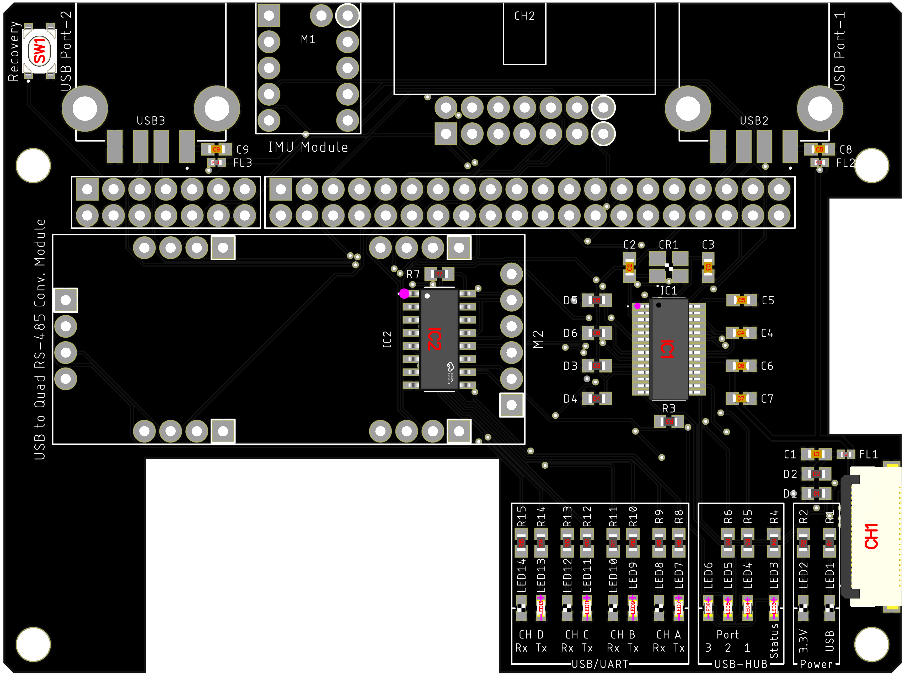

<html lang="en">

<head>
	<meta charset="uft-8">
	<meta name="author" content="Masato Kubotera">
    <meta name="description" content="">
</head>

<body>
	<h1>PCB / PCBA Order</h1>
        

            PCB/PCBA ordering were outsourced to <a href="https://jlcpcb.com/">JLCPCB</a>. 
            The following files were used to generate files for PCB/PCBA orders.
            <ul>
                <li>Eagle Design File:
                    <a href="https://github.com/JLCPCB/jlcpcb-eagle/blob/master/design%20rules/jlcpcb-2layers.dru">jlcpcb-2layers.dru</a>
                </li>
                <li>Eagle CAM File:
                    <a href="https://github.com/JLCPCB/jlcpcb-eagle/blob/master/cam/jlcpcb_2_layer_v9.cam">jlcpcb_2_layer_v9.cam</a>
                </li>
                <li>BOM/CPL Exporter ULPs:
                    <a href="https://github.com/JLCPCB/jlcpcb-eagle/blob/master/ulps/jlcpcb_smta_exporter.ulp">jlcpcb_smta_exporter.ulp</a>
                </li>
            </ul>
            These are distributed in <a href="https://github.com/JLCPCB/jlcpcb-eagle">github.com/JLCPCB/jlcpcb-eagle</a>. 
        

    <h2>PCB Order Specifications</h2>
        
           
            <table>
                <tr>
                    <th>PCB Top Image</th>
                    <th>PCB Bottom Image</th>
                </tr>
                <tr>
                    <td></td>
                    <td></td>
                </tr>
            </table>
            The following  files used to order the PCB and their specifications. 
            <ul>
                <li>Gerber data: <a href="Gerber_date.zip">Gerber_date.zip</a></li>
            </ul>
            

                
Click for more specifications

                <ul>                
                    <li>Base Material: FR-4</li>
                    <li>Layers: 2</li>
                    <li>Dimension: 87 mm* 65 mm</li>
                    <li>Product Type: Industrial/Consumer electronics</li>
                    <li>Different Design: 1</li>
                    <li>Delivery Format: Single PCB</li>
                    <li>PCB Thickness: 1.6</li>
                    <li>Impedance Control: no</li>
                    <li>PCB Color: Black</li>
                    <li>Silkscreen: White</li>
                    <li>Surface Finish: HASL(with lead)</li>
                    <li>Outer Copper Weight: 1 oz</li>
                    <li>Via Covering: Tented</li>
                    <li>Board Outline Tolerance: ±0.2mm(Regular)</li>
                    <li>Confirm Production file: No</li>                
                    <li>Remove Order Number: Yes</li>
                    <li>Deburring/Edge rounding: No</li>
                    <li>Flying Probe Test: Fully Test</li>
                    <li>Gold Fingers: No</li>
                    <li>Castellated Holes: No</li>
                    <li>4-Wire Kelvin Test: No</li>
                    <li>Paper between PCBs: No</li>
                    <li>Appearance Quality: IPC Class 2 Standard</li>
                    <li>Silkscreen Technology: Ink-jet/Screen Printing</li>
                    <li>Package Box: With JLCPCB logo</li>
                </ul>
            

        

    <h2>PCBA Order Specifications</h2>
        

            <table>
                <tr><th>PCBA Image</th></tr>
                <tr><td></td></tr>
            </table>
            The following files used to order the PCBA and their specifications.
            <ul>
                <li>BOM File: <a href="A203-V2-Expansion-Board_top_bom.csv">A203-V2-Expansion-Board_top_bom.csv</a></li>
                <li>CPL File: <a href="A203-V2-Expansion-Board_top_cpl.csv">A203-V2-Expansion-Board_top_cpl.csv</a></li>
            </ul>
            The following components were installed by PCBA.
            <table>
                <tr>
                    <th>Part Image</th>
                    <th>Top Designator</th>
                    <th>MFR.Part #</th>
                    <th>JLCPCB Part #</th>
                    <th>Manufacturer</th>
                    <th>Part Detail</th>
                </tr>
                <tr>
                    <td></td>
                    <td>C1, C7, C8, C9</td>
                    <td>GCM188R71H103KA37D</td>
                    <td><a href="https://jlcpcb.com/partdetail/MurataElectronics-GCM188R71H103KA37D/C85863">C85863</a></td>
                    <td>Murata Electronics</td>
                    <td>Multilayer Ceramic Capacitor SMD 10nF 50V ±10% X7R 0603</td>
                </tr>
                <tr>
                    <td></td>
                    <td>C2, C3</td>
                    <td>C1608C0G1H220JT000N</td>
                    <td><a href="https://jlcpcb.com/partdetail/Tdk-C1608C0G1H220JT000N/C183114">C183114</a></td>
                    <td>TDK</td>
                    <td>Multilayer Ceramic Capacitor SMD 22pF 50V ±5% C0G 0603</td>
                </tr>
                <tr>
                    <td></td>
                    <td>C4, C5, C6</td>
                    <td>GRM188R61C106KAALD</td>
                    <td><a href="https://jlcpcb.com/partdetail/MurataElectronics-GRM188R61C106KAALD/C86275">C86275</a></td>
                    <td>Murata Electronics</td>
                    <td>Multilayer Ceramic Capacitor SMD 10uF 16V ±10% X5R 0603</td>
                </tr>
                <tr>
                    <td></td>
                    <td>CR1</td>
                    <td>7V12006001</td>
                    <td><a href="https://jlcpcb.com/partdetail/TxcCorp-7V12006001/C5203634">C5203634</a></td>
                    <td>TXC Corp</td>
                    <td>Crystal 12Hz ±30ppm 12pF SMD 3225-4P</td>
                </tr>
                <tr>
                    <td></td>
                    <td>CH1</td>
                    <td>XF2M-2015-1A</td>
                    <td><a href="https://jlcpcb.com/partdetail/OmronElectronics-XF2M_20151A/C57541">C57541</a></td>
                    <td>Omron Electronics</td>
                    <td>FFC/FPC Connector SMD　20-pin 0.5mm Pitch Double-sided</td>
                </tr>
                <tr>
                    <td></td>
                    <td>D1, D2, D3, D4, D5, D6</td>
                    <td>PGB1010603MR</td>
                    <td><a href="https://jlcpcb.com/partdetail/Littelfuse-PGB1010603MR/C142698">C142698</a></td>
                    <td>Littelfuse</td>
                    <td>ESD Suppressor SMD 24V 0.06pF 0603</td>
                </tr>
                <tr>
                    <td></td>
                    <td>FL1,FL2,FL3</td>
                    <td>BLM15AX601SN1D</td>
                    <td><a href="https://jlcpcb.com/partdetail/MurataElectronics-BLM15AX601SN1D/C76886">C76886</a></td>
                    <td>Murata Electronics</td>
                    <td>Ferrite Bead SMD 600Ω ±25% 500mA 0402</td>
                </tr>
                <tr>
                    <td></td>
                    <td>IC1</td>
                    <td>FE1.1S</td>
                    <td><a href="https://jlcpcb.com/partdetail/TerminusTech-FE1_1SBSOP28BCN/C9359">C9359</a></td>
                    <td>Terminus Tech</td>
                    <td>USB Interface IC USB 2.0 Hi-Speed 4-port Hub Controller SSOP-28</td>
                </tr>
                <tr>
                    <td></td>
                    <td>IC2</td>
                    <td>SN74HC595DR</td>
                    <td><a href="https://jlcpcb.com/partdetail/TexasInstruments-SN74HC595DR/C10092">C10092</a></td>
                    <td>Texas Instruments</td>
                    <td>Shift Register 8-bit 6V SOIC-16</td>
                </tr>
                <tr>
                    <td></td>
                    <td>LED1, LED2, LED8, LED10, LED12, LED14</td>
                    <td>SML-D12M1WT86</td>
                    <td><a href="https://jlcpcb.com/partdetail/RohmSemicon-SMLD12M1WT86/C2922668">C2922668</a></td>
                    <td>ROHM Semicon</td>
                    <td>Standard LED SMD GREEN 2.2V 20mA 572nm 0603
                </tr>
                <tr>
                    <td></td>
                    <td>LED3, LED4, LED5, LED6</td>
                    <td>SML-D12Y1WT86</td>
                    <td><a href="https://jlcpcb.com/partdetail/RohmSemicon-SMLD12Y1WT86/C253534">C253534</a></td>
                    <td>ROHM Semicon</td>
                    <td>Standard LED SMD YELLOW 2.2V 20mA 590nm 0603</td>
                </tr>             
                <tr>
                    <td></td>
                    <td>LED7, LED9, LED11, LED13</td>
                    <td>SML-D12V1WT86</td>
                    <td><a href="https://jlcpcb.com/partdetail/RohmSemicon-SMLD12V1WT86/C253533">C253533</a></td>
                    <td>ROHM Semicon</td>
                    <td>Standard LED SMD RED 2.2V 20mA 630nm 0603</td>
                </tr>
                <tr>
                    <td></td>
                    <td>R1, R2, R4, R5, R6, R8, R9, R10, R11, R12, R13, R14, R15</td>
                    <td>RC0603FR-071KL</td>
                    <td><a href="https://jlcpcb.com/partdetail/Yageo-RC0603FR071KL/C22548">C22548</a></td>
                    <td>YAGEO</td>
                    <td>Thick Film Resistor SMD 1kΩ 1/10W ±1% 0603</td>
                </tr>
                <tr>
                    <td></td>
                    <td>R3</td>
                    <td>RC0603FR-072K7L</td>
                    <td><a href="https://jlcpcb.com/partdetail/Yageo-RC0603FR072K7L/C114612">C114612</a></td>
                    <td>YAGEO</td>
                    <td>Thick Film Resistor SMD 2.7kΩ 1/10W ±1% 0603</td>
                </tr>
                <tr>
                    <td></td>
                    <td>R7</td>
                    <td>RC0603FR-0710KL</td>
                    <td><a href="https://jlcpcb.com/partdetail/Yageo-RC0603FR0710KL/C98220">C98220</a></td>
                    <td>YAGEO</td>
                    <td>Thick Film Resistor SMD 10kΩ 1/10W ±1% 0603</td>
                </tr>
            </table>
            The following components are not handled by JLCPCB and could not be attached by PCBA.
            <table>
                <tr>
                    <th>Top Designator</th>
                    <th>MFR.Part #</th>
                    <th>Distributor / Part #</th>
                    <th>Manufacturer</th>
                    <th>Part Detail</th>
                </tr>
                <tr>
                    <td>CH2</td>
                    <td>HIF3FC-14PA-2.54DS(71)</td>
                    <td><a href="https://www.mouser.jp/ProductDetail/798-HIF3FC14PA254DS1">Mouser / 798-HIF3FC14PA254DS1</a></td>
                    <td><a href="https://www.hirose.com/en/product/p/CL0616-0062-2-71">Hirose Connector</a></td>
                    <td>Low Profile Connector 2.54mm-pitch 14-pin</td>
                </tr>
                <tr>
                    <td>USB2, USB3</td>
                    <td>USB1046-GF-0190-L-B-A</td>
                    <td><a href="https://www.mouser.jp/ProductDetail/640-USB1046GF0190LBA">Mouser / 640-USB1046GF0190LBA</a></td>
                    <td>GCT</td>
                    <td>USB Connectors SMD USB2.0 Type-A Top Mount</td>
                </tr>            
            </table>
            The following components were not attached due to being optional components to be attached to the bottom surface.
            <table>
                <tr>
                    <th>Top Designator</th>
                    <th>MFR.Part #</th>
                    <th>Distributor / Part #</th>
                    <th>Manufacturer</th>
                    <th>Part Detail</th>
                </tr>
                <tr>
                    <td>USB1</td>
                    <td>MUSB-5B-NE-S175</td>
                    <td><a href="https://akizukidenshi.com/catalog/g/gC-05843/">Akizuki / C-05843</a></td>
                    <td>Useconn Electronics Ltd.</td>
                    <td>USB Connectors SMD USB2.0 Mini-B Top Mount</td>
                </tr>           
            </table>
            These selected parts are listed in <a href="bom.xls">bom.xls</a>. 
            

                
Click for more specifications

                <ul>                
                    <li>PCBA Type: Economic</li>
                    <li>Assembly Side: Top Side</li>
                    <li>Tooling holes: Added by JLCPCB</li>
                    <li>Confirm Parts Placement: No</li>
                </ul>
            

        

</body>

</html>
